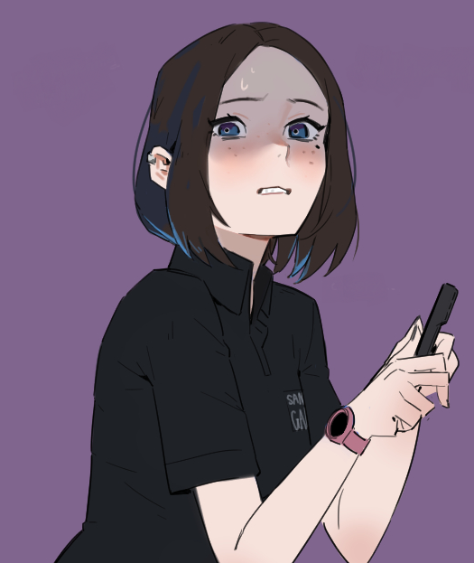

## Wholesome Series Videos Discord Server Bots

Thanks to [Zap](https://github.com/ZappiestSet81) for Collaborations on Samantha.py codes, Love you Homie :heart:

and Special Thanks to [🐧 rsetiawan7](https://github.com/rsetiawan7) for Collaborations on Samantha.py as Docker Guru.

## Development

This project is open to anyone who wants to contribute, large or small! Whether you noticed a typo or want to add a
whole new feature, go for it!

Large additions should be discussed in issues or on Discord first. If you're new to Python, ask me on [discord](https://discordapp.com/users/351147060956889088) for where to start and you can use Samantha as a starting point for a contribution.

### Testing/Workflow

To run the app, you need:

- A Discord Bot, with `server member intent` and `presence intent`.. obviously.. [click here](https://discord.com/developers/applications)
- A Discord server to test - you can't use the Wholesome Series Videos Discord Server to do tests
- [Python version 3.8.6](https://www.python.org/downloads/release/python-386/)
- _This is optional_, A MongoDB for levelling system (Pick one)
  - [MongoDB Community Server (Offline)](https://www.mongodb.com/try/download/community)
  - [MongoDB Atlas (Online)](https://www.mongodb.com/cloud/atlas)
- A Good Code IDE, obviously.. I recommend you [Visual Studio Code](https://code.visualstudio.com)

If you don't own/admin a Discord server, creating one is simple, you can do it from the same menu you join discord servers from.

### Installing

- first, you need to install the Python and MongoDB (Optional)
  you can see the docs for [python](https://docs.python.org/3/using/windows.html) and [mongodb](https://docs.mongodb.com/manual/tutorial/install-mongodb-on-windows/)
- after that, you can install the required files, with pip (python package manager thingy)

  `pip install -r "requirements.txt"`

- next stop, copy your bot token in the end of `main.py`.

### Levelling Systems (Optional)

- if you want the levelling systems.

  - after that, you need to make a database on mongodb, refer to this [guide](https://www.mongodb.com/basics/create-database).
    the database name should be `discord` and the collation name is `levelling`

  - and then, you can add the mongodb links on `cogs/levelsys.py`

- if you don't want the levelling systems.

  - If you're didn't want levelling system, just delete this file `cogs/levelsys.py`

### Warning Systems (Important, well.. sort of)

So, basically.. Warning systems are connected with `cogs/mute.py` and `cogs/kick.py`. so in order to use those two commands, you need to use warning systems, otherwise.. it will erroring all over the place.

- To use the Warning systems (assuming you already create a database named `discord`), just create another collation, the name is `muted`, `kicks`, and `warning`

- and then, you can add the mongodb links on `cogs/warnsys.py`, `cogs/mute.py`, and `cogs/kick.py`

- if you don't use the levelling systems.

  - you need to make a database on mongodb, refer to this [guide](https://www.mongodb.com/basics/create-database). the database name should be `discord` and the collation name is `muted`, `kicks`, and `warning`

  - and then, you can add the mongodb links on `cogs/warnsys.py`, `cogs/mute.py`, and `cogs/kick.py`

### Finalize things...

- Whenever you're ready, You can start the bot with this commands.

  - `py main.py` = for windows
  - `python3 main.py` = for linux

and, Voila! You've setup the bot!

### Contributions✨

Contributions of any kind welcome!
